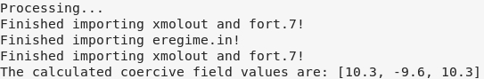
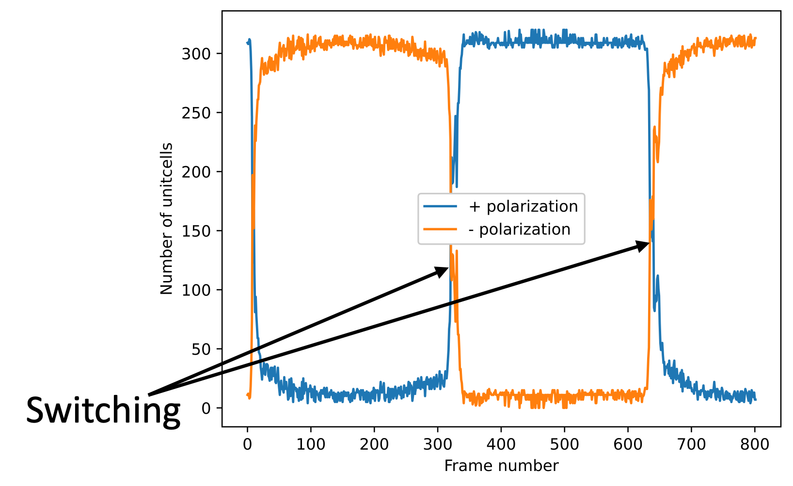

# MD-toolkit

MD-toolkit is a Python-based module designed to facilitate complex tasks involved in Molecular Dynamics (MD) simulations and materials analysis. It offers a range of tools specifically tailored for MD analysis and manipulation. Currently, the code supports ADF (Amsterdam Density Functional) software, with plans to extend compatibility to other MD software packages such as LAMMPS in the future.

<div align="center">
  
</div>

<div align="center"><strong>Figure 1. A representation of dipole analysis performed by MD-Toolkit.</strong></div>

## Table of Contents

- [Dipole Analyzer](#dipole-analyzer)
- [Dopant Analyzer](#dopant-analyzer)
- [Electric Field Generator](#electric-field-generator)
- [Atom Charge Modifier](#atom-charge-modifier)

## Dipole Analyzer

The Dipole Analyzer tool allows the analysis of dipole moments in MD simulations for materials analysis. It enables users to calculate, visualize, and manipulate dipole moment data efficiently. The program outputs a .csv file containing the calculated polarizations accross consequent frames in the trajectory. This module was initially developed as a part of my research on "*Electronically swichable polarization in Mg-substituted ZnO*", but could be extended to the study of electic polarization in other metal-oxised such as BaTiO3.

### Example
The program offers multiple options for dipole analysis as below. To get help on available options and their usage, simply run:
```bash
Python dipole_analyzer.py -h
```


1. **Report for calculated coercive fields:** This feature calculates the total polarization of the structure and finds the coercive field values. No output is generated by selecting this option, rather the calculation report is shown on the screen:
```bash
#Execute the Dipole Analyzer module:
Python dipole_analyzer.py -m 1
```


Note that since, in this example, the applied electric field is more than one cycle of a sinusoidal function, there are more than two values of hysteresis reported.

2. **Generate the hysteresis plots and report the calculated coercive fields:** This option would also save a '.eps' format image of the hysteresis in path: "dipole_analysis > total_pilarization". In addition, a csv file will be saved, showing the total polarization of the system calculated for each frame (PE.csv).

<div align="center">
  
</div>

<div align="center"><strong>Figure 2. Hysteresis plot for ZnO.</strong></div>
<br>

3. **Local polarization analysis:** This option divides the slab into a number of user-specified grids in X-, Y-, and Z-directions, and calculates the polarization for each grid. This option is used to observe the local polarization trends such as formation of domains and domain-wall migration.

<div align="center">
  
</div>

<div align="center"><strong>Figure 3. A snapshot of the local polarization video showing the domain-wall at Z=150 A.</strong></div>
<br>
Note that the original file generated by MD-Toolkit is a '.gif' file and only a snapshot of the video has been shown here. The videos could be found in "dipole_analysis > local_pilarization"
<br>

4. **3D video of the dipole moments:** This option shows the dipole vectors for each unit cell in the system, in a 3D format.

<div align="center">
  
</div>

<div align="center"><strong>Figure 4. A snapshot of the 3D visualization of the dipole moments at the instance of switching.</strong></div>
<br>

5. **Visualizing the switching trends:** This feature shows the trends of ferroelectric switching through the simulation.
   
<div align="center">
  
</div>

<div align="center"><strong>Figure 5. The history of polarization reversal in the system through the entire simulation.</strong></div>
<br>

## Dopant Analyzer
Cation misfit has been known as a novel pathway to deviate from von-Neumann structures, rendering polarization reversal by replacing cations of a crystall with a cation of a different size. This feature uses three user-specified options to place dopants in an "un-doped" system. The three options are uniform placement, random placement, and clustered placement. In uniform placement, the dopants are placed such that their spacial distribution follows a uniform scheme. This is done by following the "farthest point sampling" algorithm. In random placement, a random seed will be passed to select a subset of original cations to be replaced by the dopant. In clustered placement, all dopants form a central cluster in the slab. The results of each placement is shown below:

<div align="center">
  
</div>

<div align="center"><strong>Figure 6. Doping results with three placement configurations.</strong></div>
<br>


## Electric Field Generator
